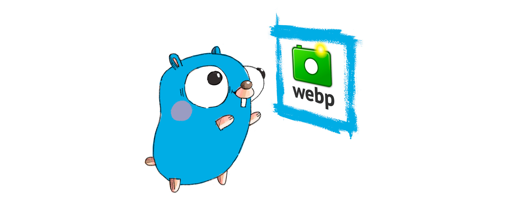

# go-webp
[](https://travis-ci.com/github/kolesa-team/go-webp)
[](https://godoc.org/github.com/kolesa-team/go-webp)
[](https://goreportcard.com/report/github.com/kolesa-team/go-webp)
[](https://codecov.io/gh/kolesa-team/go-webp)

Golang Webp library for encoding and decoding, using **C** binding for Google libwebp

## Requirements
[libwebp](https://developers.google.com/speed/webp/docs/api)

## Benchmarks
```text
% go test -bench "^BenchmarkDecode" ./webp                                                                                
goos: darwin
goarch: amd64
pkg: github.com/kolesa-team/go-webp/webp
BenchmarkDecodeLossy-12                       45          25965139 ns/op
BenchmarkDecodeXImageLossy-12                 13          90735879 ns/op
BenchmarkDecodeLossless-12                    64          18887482 ns/op
BenchmarkDecodeXImageLossless-12              27          42422596 ns/op
PASS
ok      github.com/kolesa-team/go-webp/webp     7.877s
```

## Install libwebp
#### MacOS:
```bash
brew install webp
```
#### Linux:
```bash
sudo apt-get update
sudo apt-get install libwebp-dev
```

## Install
`go get -u github.com/kolesa-team/go-webp`

## Examples

#### Decode:
```go
package main

import (
	"image/jpeg"
	"log"
	"os"

	"github.com/kolesa-team/go-webp/decoder"
	"github.com/kolesa-team/go-webp/webp"
)

func main() {
	file, err := os.Open("test_data/images/m4_q75.webp")
	if err != nil {
		log.Fatalln(err)
	}

	output, err := os.Create("example/output_decode.jpg")
	if err != nil {
		log.Fatal(err)
	}
	defer output.Close()

	img, err := webp.Decode(file, &decoder.Options{})
	if err != nil {
		log.Fatalln(err)
	}

	if err = jpeg.Encode(output, img, &jpeg.Options{Quality:75}); err != nil {
		log.Fatalln(err)
	}
}
```

```bash
go run example/decode/main.go
```

#### Encode
```go
package main

import (
	"github.com/kolesa-team/go-webp/encoder"
	"github.com/kolesa-team/go-webp/webp"
	"image/jpeg"
	"log"
	"os"
)

func main() {
	file, err := os.Open("test_data/images/source.jpg")
	if err != nil {
		log.Fatalln(err)
	}

	img, err := jpeg.Decode(file)
	if err != nil {
		log.Fatalln(err)
	}

	output, err := os.Create("example/output_decode.webp")
	if err != nil {
		log.Fatal(err)
	}
	defer output.Close()

	options, err := encoder.NewLossyEncoderOptions(encoder.PresetDefault, 75)
	if err != nil {
		log.Fatalln(err)
	}

	if err := webp.Encode(output, img, options); err != nil {
		log.Fatalln(err)
	}
}
```
```bash
go run example/encode/main.go
```

## TODO
- return aux stats
- container api
- incremental decoding

## License
MIT licensed. See the LICENSE file for details.

